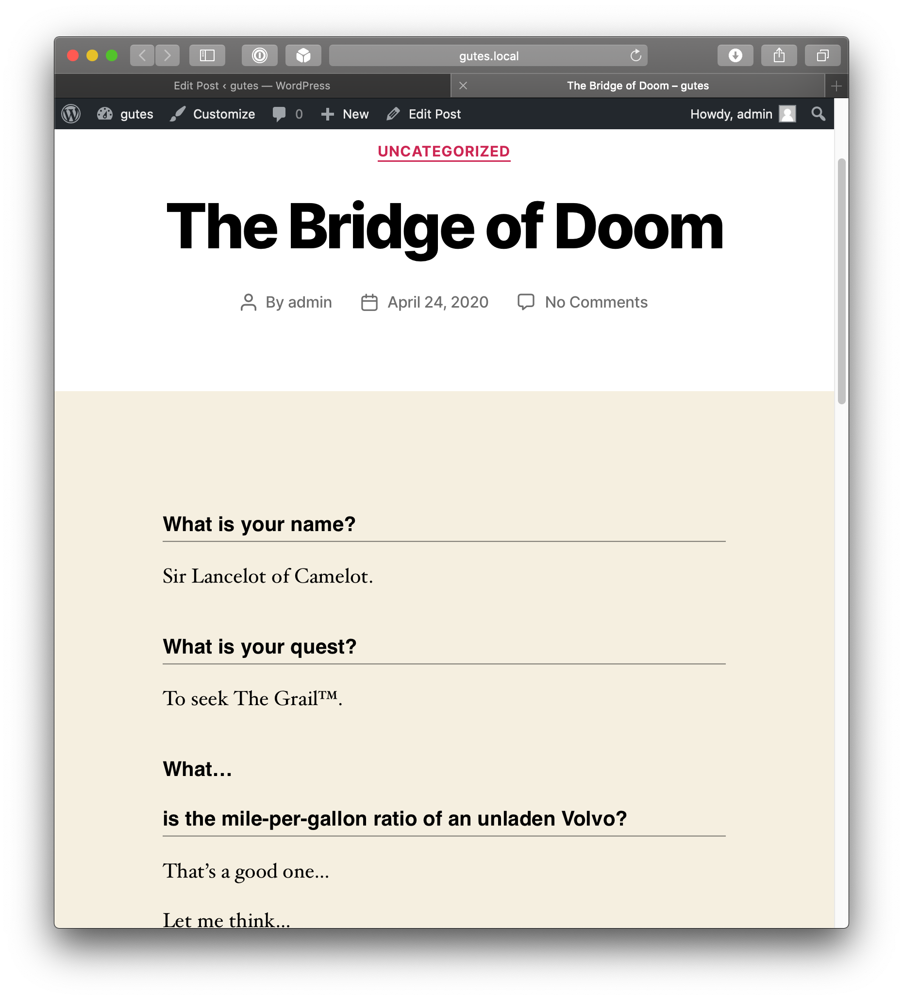

# Interview Question

For the WordPress Block Editor (a.k.a. Gutenberg).




## Setup

1. Navigate to the downloaded directory
2. Run `npm install & npm run build`
3. ???
4. Profit!

**This plugin is still under development!** While you can try it out (and I welcome any feedback),
the block structure may change in a way that breaks existing blocks.

## Styling

The output of the block is very simple:

```html
<div class="wp-block-oddevan-interview-question">
	<div class="question">
		<p>What is your quest?</p>
	</div>
	<div class="answer">
		<p>To seek The Grail™.</p>
	</div>
</div>
```

## Hooks

No hooks yet.